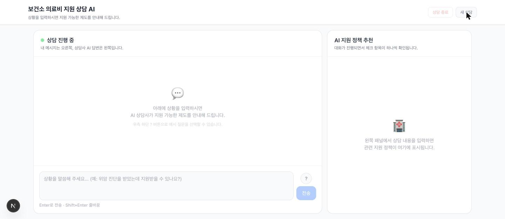
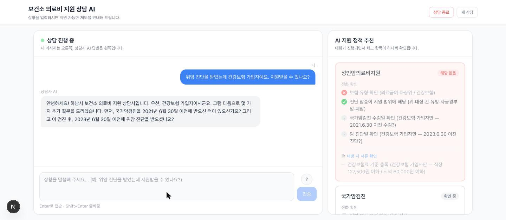
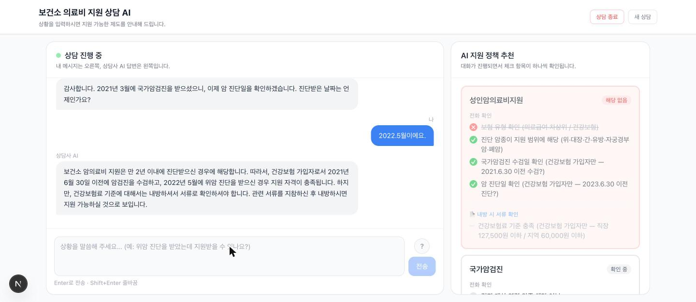
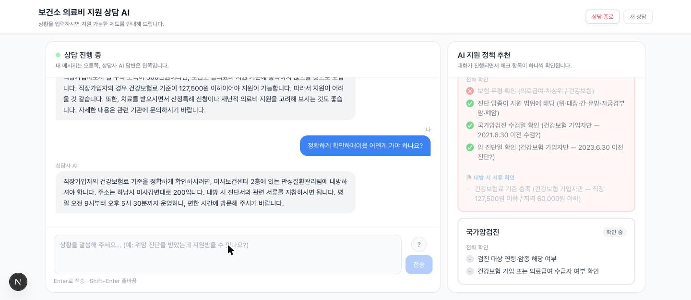

# 보건소 의료비 지원 상담 AI

> 하남시 보건소 의료비 지원 전화 상담원을 위한 AI 1차 응대 시스템

시민이 전화로 상황을 설명하면 AI가 해당 정책(암의료비지원 / 희귀질환의료비지원 /
국가암검진)을 분류하고 체크리스트로 자격 요건을 확인합니다. 소득·재산처럼 전화로
판정할 수 없는 항목은 판정하지 않고 내방 안내로 마무리합니다.

## 데모

| | |
|---|---|
| **1. 초기 화면** — 좌측 채팅 / 우측 체크리스트 카드. | **2. 정책 분류** — "위암 진단 + 건강보험 가입자" 한 문장으로 정책 인식 + 체크리스트 생성. |
|  |  |
| **3. 체크리스트 갱신** — 수검일·진단일 답변 후 항목이 초록으로 갱신. 건강보험료(소득)는 미확인 유지. | **4. 내방 안내로 마무리** — 확정 불가 항목이 남으면 주소·운영시간·지참서류를 안내. |
|  |  |

> 캡처 중 LLM이 자연어로 "월 소득 300만원이면 지원이 어려울 것 같다"고 먼저 판단해버린
> 턴이 나왔습니다. 체크리스트 항목 자체는 미확인으로 정확히 고정됐지만, 응답 텍스트의
> 판정까지는 막지 못했습니다. [한계](#한계) 참고.

## 목차

- [기능](#기능)
- [데모](#데모)
- [빠른 시작](#빠른-시작)
- [역할 분리](#역할-분리)
- [로드맵](#로드맵)
- [검증 결과](#검증-결과)
- [한계](#한계)
- [기술 스택](#기술-스택)

## 해결하는 문제

대상 사용자는 시민이 아니라 하남시 보건소 의료비 지원 전화 상담원입니다. 상담원은
통화마다 진단명·보험 유형·진단 시점을 파악하며 3개 정책의 소득기준·대상질환·신청조건을
동시에 대조해야 합니다. 필자가 하남시 보건소 만성질환팀 상담원으로 근무하며 반복해서
겪은 실수는 두 가지입니다.

- **오안내**: 조건을 암산으로 대조하다 자격이 안 되는데 "될 것 같다"고 안내.
- **판정 불가 항목의 임의 확정**: 소득·재산은 서류로만 확인되는데, 상담원도 "이 정도면
  되겠다"고 먼저 판단해버림.

체크리스트로 표준화하면 줄일 수 있다고 봤는데, 이를 LLM으로 만들면 같은 실수(특히
두 번째)를 LLM이 반복할 위험이 있어 [역할 분리](#역할-분리)로 통제했습니다. 상담원
여러 명이 돌아가며 전화를 받는 소규모 공공기관 창구에 적용 가능한 구조입니다.

## 기능

- **정책 분류**: 시민 발화에서 해당 가능한 지원 정책을 GPT function calling으로 자동 선별
- **체크리스트 순차 확인**: 정책별 자격 조건을 대화 턴마다 상태 머신으로 갱신
- **전화 판정 불가 항목 동결**: 소득·재산처럼 서류로만 확인 가능한 항목은 LLM 출력과
  무관하게 항상 미확인(`None`) 처리
- **내방 핸드오프**: 확정할 수 없는 항목이 남으면 상담을 얼버무리지 않고 내방 안내로 전환
- **상담사 훈련 모드**(`/train`): AI가 사전 정의된 민원인 페르소나(`src/data/personas.yaml`)를
  연기하고, 훈련자가 상담사로서 응대하면 체크리스트가 실시간 코칭 피드백으로 갱신됩니다.
  페르소나에게 자격 조건은 알려주지 않으므로 훈련자가 직접 질문해 알아내야 합니다.

## 빠른 시작

### 요구사항

- Python 3.12, Node 18+
- OpenAI API 키 (필수). Supabase는 선택 — 비워두면 세션 저장을 건너뜁니다.

### 백엔드

```bash
python -m venv .health_venv
source .health_venv/bin/activate
pip install -r requirements.txt
```

`.env`에 아래 값을 채웁니다. `OPENAI_API_KEY`만 필수이고 나머지는 기본값이 있습니다.

```bash
OPENAI_API_KEY=          # 필수
CHROMA_PERSIST_DIR=      # 선택, 기본값 ./chroma_db
LLM_MODEL=               # 선택, 기본값 gpt-4o
SUPABASE_URL=            # 선택 — 비우면 세션 저장을 건너뜀
SUPABASE_ANON_KEY=       # 선택
```

```bash
python scripts/ingest_policies.py   # 정책 문서 3종을 ChromaDB에 인덱싱 (최초 1회)
uvicorn src.api:app --reload --port 8000
```

### 바로 확인해보기

```bash
# 단일턴 정책 분류
curl -s -X POST http://localhost:8000/query \
  -H "Content-Type: application/json" \
  -d '{"query": "위암 진단을 받았는데 건강보험 가입자예요. 지원받을 수 있나요?"}'

# 멀티턴 상담 — 첫 턴은 checklist를 빈 배열로 보냄
curl -s -X POST http://localhost:8000/chat \
  -H "Content-Type: application/json" \
  -d '{
        "messages": [
          {"role": "user", "content": "위암 진단을 받았는데 건강보험 가입자예요. 지원받을 수 있나요?"}
        ],
        "checklist": []
      }'
```

`/chat` 응답의 `checklist`를 다음 요청의 `checklist`에, 누적된 `messages`와 함께
그대로 실어 보내면 상담이 이어집니다. 서버는 세션 상태를 저장하지 않고 클라이언트가
매 턴 전체 상태를 들고 다닙니다.

### 프론트엔드

```bash
cd frontend
npm install
echo "NEXT_PUBLIC_API_URL=http://localhost:8000" > .env.local
npm run dev
```

### 주요 엔드포인트

| 경로 | 역할 |
|---|---|
| `POST /classify` | 발화 → 해당 가능 정책 분류 |
| `POST /chat` | 멀티턴 상담. `messages`·`checklist`를 매 턴 클라이언트가 보유해 전달 |
| `POST /query` | 단일턴 정책 분류 (레거시 경로, eval에서 사용) |
| `POST /session-end` | 상담 세션 저장 (Supabase 미설정 시 생략) |
| `GET /health` | 헬스체크 |
| `GET /personas` | 훈련 모드용 민원인 페르소나 목록 (`id`·`label`만 반환 — 자격 조건도, eval용 기대 결과도 비공개) |
| `POST /train/start` | 훈련 세션 시작. 선택한 페르소나의 첫 발화 + 초기 체크리스트 반환 |
| `POST /train/turn` | 훈련 모드 멀티턴. 훈련자(상담사 역)의 응답에 이어 AI 민원인의 답변과 갱신된 체크리스트를 반환 |

## 역할 분리

어떤 기술 스택을 썼는가보다, 상황별로 LLM·코드·사람 중 누가 판단을 맡는지에 집중했습니다.

| 레이어 | 맡는 것 | 왜 여기인가 |
|---|---|---|
| **LLM** | 자연어 이해, 정책 분류, 상담 진행, 체크리스트 항목 추출·업데이트 | 시민 발화 형식이 정해져 있지 않아 규칙으로 다 열거할 수 없는 유연한 판단이 필요 |
| **코드 / Rule** | 전화 판정 불가 항목 동결, 결정적 불가 조건 우선 적용, 확정값 보호, 출력 스키마 검증 | 틀리면 피해가 직접적이고 되돌릴 수 없는 지점 — 프롬프트 지시만으로는 신뢰할 수 없어 코드로 강제 |
| **사람 (상담원 / 담당자)** | 내방 안내 이후 서류 확인, 최종 자격 판정 | 소득·재산처럼 시스템이 원천적으로 확인할 수 없는 판단 |

판단은 LLM이 하지만, 아래 네 가지는 LLM 출력과 무관하게 코드가 항상 강제합니다.

1. **전화 판정 불가 항목 동결** — 소득·재산 등 `visit` 항목은 LLM이 뭐라고 출력하든 미확인으로 고정
2. **결정적 불가 조건을 LLM 판단보다 우선** — cutoff 조건이 검출되면 LLM의 최종 판단을 교정
3. **확정값 보호** — 확정된 값이 이후 턴에서 미확인 상태로 되돌아가지 못하게 차단
4. **LLM 출력 구조 검증** — 스키마 위반 응답은 조용히 버림 (오염보다 누락이 안전)

## 로드맵

지금까지는 AI가 상담사 역할을 맡아 시민 발화에 응대하는 방향으로 만들었는데, 여기에 AI가
민원인을 연기하는 **상담사 훈련 모드**를 더했다. 원래 `tests/run_counselor_eval.py`의 멀티턴
eval에서만 쓰던 "LLM 시민 시뮬레이터"를 정식 기능으로 승격한 것이라, 페르소나 데이터
(`src/data/personas.yaml`)는 eval과 훈련 모드가 같은 소스를 공유한다.

```text
상담사 훈련 (지금 — AI가 민원인 역할, 체크리스트가 코칭 피드백)
    ↓
실제 상담 어시스트 (향후 — AI가 실시간 상담사-시민 대화를 옆에서 듣고
                    누락된 확인 항목·관련 지침을 상담사에게 알림)
```

실시간 어시스트 방향은 `origin/claude/progress-report-qh6vwq` 브랜치에서 상담사 co-pilot/HITL
검수 UI로 한 차례 실험됐으나 `main`에 병합되지 않았다. 이번 훈련 모드는 그 방향으로 가기 전
단계로, 체크리스트 코칭 로직(`generate_counselor_response`)을 사람이 쓴 상담사 발화에도 그대로
적용해본다는 점에서 실시간 어시스트의 핵심 메커니즘을 미리 검증하는 성격도 있다.

## 검증 결과

LLM이 개입하는 층은 실행마다 결과가 달라져 여러 번 돌린 분포로, 코드로 강제하는
층은 LLM 없이 결정적으로 검증합니다.

- 코드 가드레일: **15/15** (결정적 — `tests/test_guardrails.py`, LLM·서버 불필요)
- `/query` 정책 분류: 5회 실행에서 **7~10/10**
- `/chat` 멀티턴 상담: 3회 실행에서 **4~6/6**

```bash
python tests/test_guardrails.py      # 결정적, LLM·서버 불필요
python tests/run_eval.py             # /query 10 시나리오, 서버 실행 필요
python tests/run_counselor_eval.py   # /chat 6 시나리오, LLM 시민 시뮬레이터 포함
```

## 한계

**현재 한계**
- 정책 커버리지는 암의료비지원(소아암 포함)·희귀질환의료비지원·국가암검진 3종으로 한정.
  산정특례·재난적의료비는 미포함.
- "담당자 핸드오프"의 실체는 에스컬레이션 큐나 알림이 아니라, 상담 세션을
  Supabase에 저장해 담당자가 이후 참조할 수 있게 남기는 수준입니다.
- 소득 기준 금액이 정책 문서 frontmatter에 구조화돼 있으나, 현재는 LLM 컨텍스트로만
  쓰이고 비교·계산 로직에는 쓰이지 않습니다 (전화 상담에서는 소득을 판정하지 않는다는
  설계 원칙에 따른 의도적 선택).

**측정으로 드러난 한계**
- `/chat` 멀티턴 6개 시나리오 중 통과 개수가 실행마다 4개~6개로 달라집니다. 미종료
  (10턴 소진)와 체크리스트 업데이트 누락이 주 원인이고, 재현 조건을 아직 특정하지
  못했습니다.
- 건강보험 가입자 삼분법 판정이 실행마다 뒤집힙니다. 조건이 정책 문서 텍스트로만
  있고 코드 규칙이 아니기 때문입니다.
- eval 하네스 자체의 한계: 종료 판정이 키워드 매칭(`TERMINATION_SIGNALS`)이라
  표현이 달라지면 오판할 수 있습니다.
- **자연어 응답이 소득을 판정해버리는 경우가 있습니다.** 체크리스트의 `visit` 항목은
  코드로 미확인 고정되지만, 이는 구조화된 상태값만 보호합니다. 응답 텍스트 자체가
  소득을 단정해버리는 것은 아직 막지 못합니다.
- **훈련 모드 페르소나는 6종으로, 전부 저자 본인의 암묵지(현장 근무 중 겪은 상담 패턴)를
  바탕으로 작성됐습니다.** 실제 보건소 민원 게시판·통계 등 외부 데이터를 수집해 페르소나를
  확장하는 것은 시도하지 않았습니다.

## 기술 스택

- **백엔드**: FastAPI, OpenAI SDK(GPT-4o, text-embedding-3-small), ChromaDB
- **프론트엔드**: Next.js 15 (채팅 패널 + 정책 체크리스트 카드 UI)
- **저장**: Supabase (세션·메시지·토큰 사용량 저장, 미설정 시 graceful skip)

**의도적으로 쓰지 않거나 얕게 쓴 것들**:

- **RAG 검색 깊이** — 정책 문서가 3개뿐이라 검색 선별이 핵심이 아니라고 판단해,
  청킹 없이 매 턴 전체 문서를 컨텍스트로 넘겼습니다.
- **LangChain** — 임베딩 → 검색 → LLM 직선 파이프라인에 추상화 레이어를 얹을
  이유가 없었습니다. OpenAI SDK 직접 호출이 디버깅에 더 투명합니다.
- **정책별 전담 에이전트 (멀티 에이전트)** — 한 시민이 복수 정책에 동시에 해당하는
  경우가 많아, 에이전트별 결과를 조정하는 별도 조정자를 두면 결국 단일 LLM 호출과
  같은 역할을 하게 됩니다.
- **Playwright 크롤링** — 대상 페이지가 정적 렌더링임을 확인하고 BeautifulSoup으로
  대체했습니다.

공공기관 공개 자료를 크롤링한 데이터를 포함하고 있어 라이선스는 아직 정하지 않았습니다.
